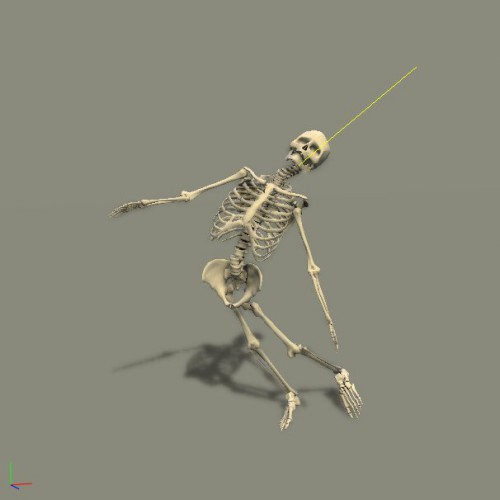
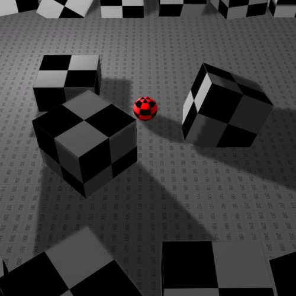
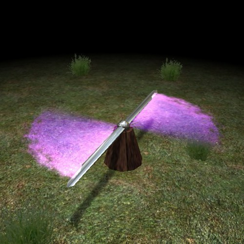

# ShiVa 192 Editor - Classic Additional Samples
This repo contains a collection of classic ShiVa 1.5 to 1.9 demos from the years 2006 to 2011. No documentation is provided, but since most samples are very small, they still provide nice learning material for those who want to expand their horizon beyond the ShiVa standard sample set. And for everyone who has been working with ShiVa since the early 1.5 days, these STEs are a nostalgia treasure trove!

## Packs included
- BasicSensorDemo
- BuoyancyDemo
- DebugFont
- DungeonGenerator
- FPSDemo
- HLDThirdPersonViewTest
- iBall3D
- IrisFlare
- LensFlare
- PictureManipulation
- PolyTrailDemo
- RagDol
- S3DStartup
- SkyBoxSample
- Stealth_DynamicShadowDetection
- TEST_3DSound
- TEST_ChangeTexture
- TEST_ClickAndGo
- TEST_IPhoneViewportRotation
- TEST_Microphone
- TEST_Modal
- TEST_MultiTouch
- TEST_onMouseButtonDown
- TEST_ScrollingText
- TEST_Vibrations
- TEST_ViewportRotation
- TEST_WallHole
- TEST_Wiimote
- TEST_WiiMouseEmulation
- TextureSliderOSV
- Tweener

# License
The ShiVa license applies to all of these STE packages: The code is free to use (MIT), but art assets are copyrighted and cannot be used in your own projects without written authorization.

# Screenshots
  

